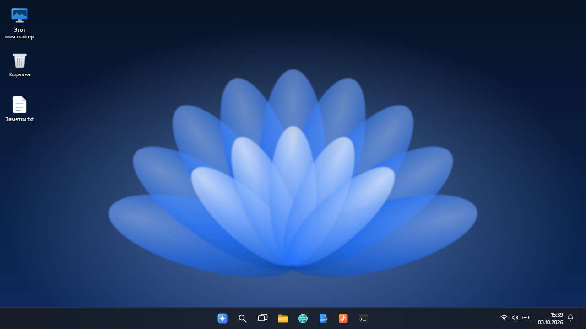
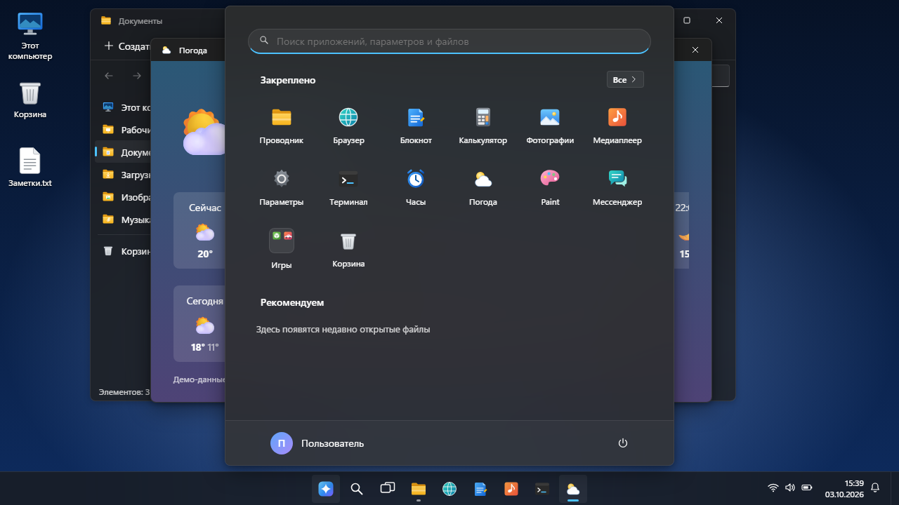

# WindowsDemo - Windows 11 style shell

**English** · [Русский](README.ru.md)

A Windows 11 style desktop shell that runs entirely in the browser: no server, no internet, no images or fonts from the original system. Icons, wallpapers and apps are drawn by code in this repository.

**[▶ Open online](https://alexalesha.github.io/WindowsDemo/)**

> Fan-made interface concept. Not affiliated with or endorsed by Microsoft. Windows is a trademark of Microsoft Corporation.

The interface is in Russian.





## What it does

- Windows that behave like windows: move, resize, snap to the halves and corners of the screen, minimise, maximise; task view, notifications.
- Start menu with search, all apps and a Games folder; taskbar with clock and tray.
- Files are kept in the browser (IndexedDB): File Explorer with drag and drop, cut and paste, import from disk, a preview pane, and a Recycle Bin.
- Apps: Notepad, Calculator, Settings (theme, accent colour, wallpaper, transparency, time format for the whole system), Browser with built-in pages, Photos, Media Player (synthesised music), Clock, Weather (demo data), Terminal, Paint and Messenger.
- **Games:** the ten games of the [GameRoom](https://github.com/ALEXalesha/GameRoom) collection
  open in a window: Cube World, Blockcity, Operation: Perimeter, Horizon Drift, Dino Run, Jump Jump,
  Hot Jungle, Space Gun, Falling Blocks and Sudoku. Each is its own repository: on GitHub Pages the
  window loads `../../<repository>/` of the same site (for example
  [AlexMine](https://alexalesha.github.io/AlexMine/)). Locally, clone the game repositories next to
  this one. A game in a minimised or inactive window is paused (the protocol is in
  `_os-shared/README.md`).


The shell lives in `win11_3/`; it is built from `win11_3/src/` by `node win11_3/src/build.js`. The root `index.html` just opens it.


## Run locally

Open `index.html` or `win11_3/index.html` in Chrome, Edge or Firefox.

## Tests

Playwright laws in `tests/` open the page by its file address in headless Chromium, one at a
time:

```
npm install
npx playwright install chromium
npm test
```

The tests for game windows run only when the game repositories lie next to this one; otherwise
they are skipped. Mouse capture in the tests is always a stub. `npm run screenshots` makes the pictures above.

## History

The shell was made in the [GameRoom](https://github.com/ALEXalesha/GameRoom) collection (folders `web/win11_3` and `web/_os-shared`). This repository carries it with its commit history, starting after the first raw import (it still had a four-square boot logo like the Windows one); the start page, the games table for the separately published games and the tests were added for this publication.

## Licence

MIT, see [LICENSE](LICENSE).
